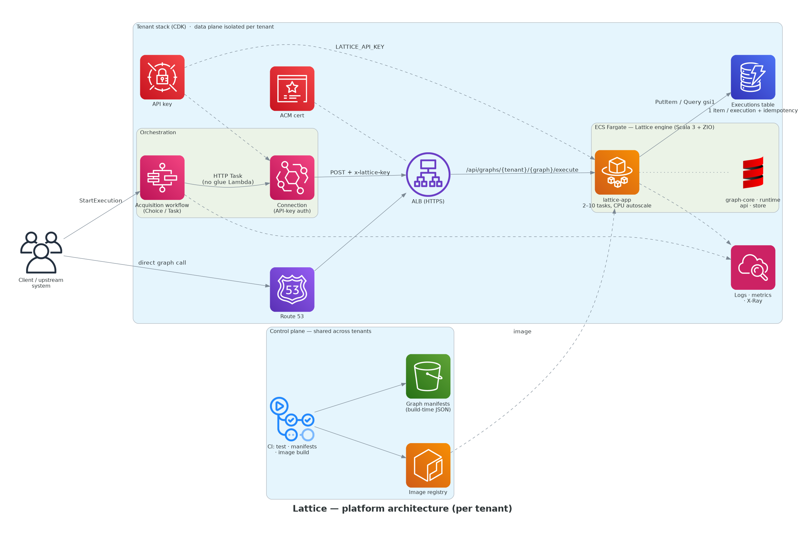
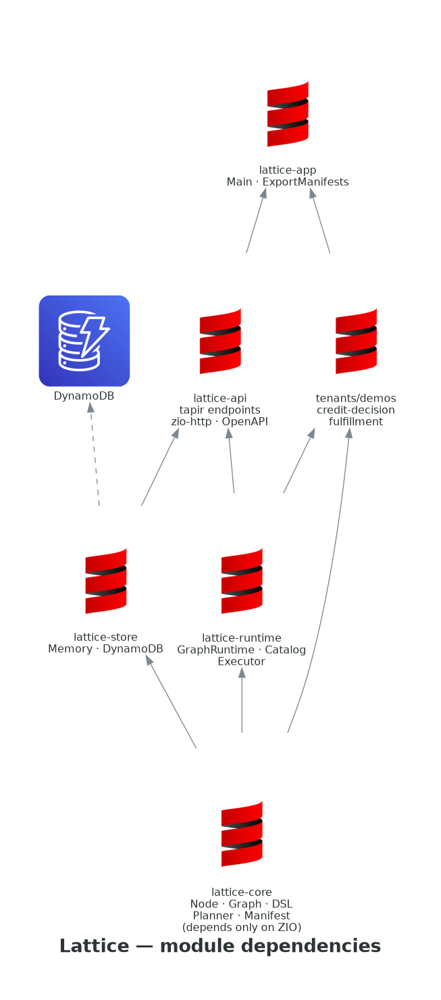
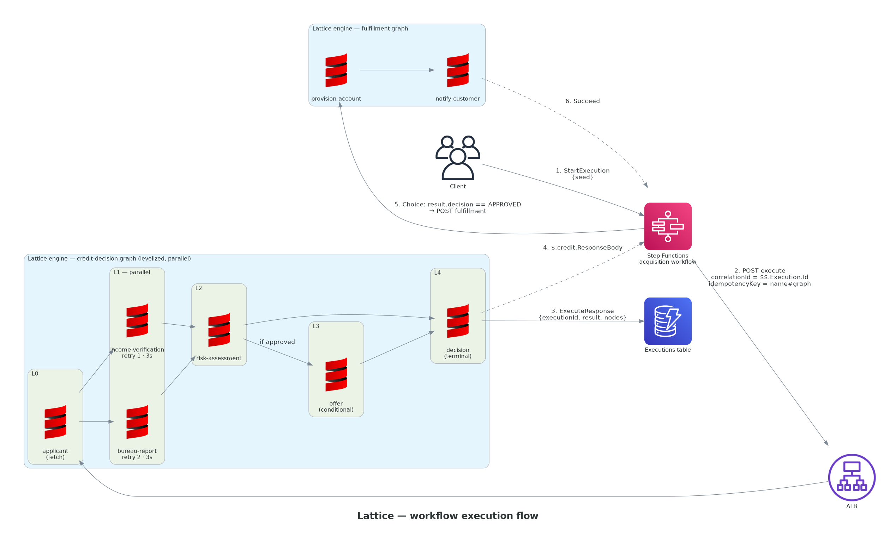

# Lattice

**A decision-graph engine on Scala 3 + ZIO.** Declare a decision as a DAG of `fetch` / `compute` / `computeIf`
nodes; Lattice levelizes it, runs each level in parallel with per-node timeouts and retries, and persists one
execution record with a full node-level trace. AWS Step Functions orchestrates multi-step business processes
around graphs through its native HTTP Task, so a workflow and the decisions it makes share one correlation
trail from the first request to the last write.

> **Repo description:** Lattice — a decision-graph engine on Scala 3 + ZIO: declarative DAGs of fetch/compute nodes, build-time manifests, single-record execution history, orchestrated by AWS Step Functions.
>
> **Topics:** `scala` `zio` `dag` `decision-engine` `step-functions` `aws-cdk` `ecs-fargate` `dynamodb` `tapir` `platform-engineering`
> (`make repo-metadata` applies both via `gh`.)



## Design principles

**A graph is a value.** Nodes, edges, policies, and the terminal are plain data. `GraphPlanner.manifest`
describes a graph without executing it; `ExportManifests` writes that description to JSON at build time; the
catalog serves it over HTTP. Topology questions — "which graphs touch the bureau?", "what does node X depend
on?" — are answered by `GET /api/nodes/search` and `GET /api/graphs/{tenant}/{graph}/manifest` with no engine
introspection required.

**Conditional edges are first-class.** `computeIf` declares both the condition and the dependency, so the
planner sees the edge, the manifest documents it, and a skipped branch shows up in the trace as `Skipped`
rather than silently not happening.

**One record per execution.** An execution is a single DynamoDB item carrying its node-level trace inline.
Idempotency claims live in the same table as a conditional put. Recent-executions queries hit one GSI.

**The orchestrator talks to the engine directly.** Step Functions calls Lattice through its native HTTP Task
via an EventBridge Connection that carries the API key. The state machine itself injects
`correlationId = $$.Execution.Id` and `idempotencyKey = <execution name>#<graph>` into every graph call, which
means a Step Functions retry replays the stored result instead of re-running the decision, and a workflow
step can always be traced to the exact graph execution it produced.

**Contract first.** Endpoints are tapir descriptions; the zio-http server, the OpenAPI document at `/docs`,
and any generated clients all derive from the same source.

**Wiring is checked at compile time.** Services are composed with `ZLayer`; a missing dependency is a
compile error, not a startup failure.

**Tenant isolation without tenant drift.** Each tenant gets its own stack — service, table, API key, state
machine — while code, contract, CI, and container image are shared.

## A graph, as code

```scala
graph("demos", "credit-decision", version = "1.2.0", timeout = 20.seconds) {
  val applicant = fetch("applicant")(seed => ZIO.fromEither(seed.as[Applicant]).mapError(BadSeed(_)))
  val report    = compute("bureau-report", policy = Policy(3.seconds, retries = 2, 100.millis))(applicant)(a => bureau.pull(a.applicantId))
  val verified  = compute("income-verification")(applicant)(a => income.verify(a.applicantId, a.statedIncome))
  val risk      = compute3("risk-assessment")(applicant, report, verified)((a, r, i) => ZIO.succeed(RiskRules.assess(a, r, i)))
  val offer     = computeIf("offer")(risk)(_.approved)(risk)(r => ZIO.succeed(OfferEngine.build(r)))
  val decision  = compute2("decision")(risk, offer)((r, o) => ZIO.succeed(Decision(..., o)))
  terminal(decision)
}
```

`bureau-report` and `income-verification` run in the same level, in parallel, automatically. A node can only
reference handles that already exist, so cycles are unrepresentable in the DSL; the planner still checks
hand-built graphs.

## Layout

```
modules/core      Node · Graph · DSL · GraphPlanner · Manifest        (depends only on ZIO + zio-json)
modules/runtime   GraphRuntime (interpreter) · GraphCatalog · Executor
modules/store     ExecutionStore: MemoryExecutionStore · DynamoExecutionStore
modules/api       tapir Endpoints · Routes (zio-http, API-key guard, Swagger)
tenants/demos     credit-decision · fulfillment graphs, simulated clients, rules
app               Main · AppConfig · ExportManifests
infra             CDK: one stack per tenant (VPC, ECS Fargate + HTTPS ALB, DynamoDB, Secrets, Step Functions)
docs/diagrams     diagrams-as-code (render.py) → PNG
```



## API

| Method | Path | Purpose |
|---|---|---|
| `POST` | `/api/graphs/{tenant}/{graph}/execute` | Execute; body `{ seed, idempotencyKey?, correlationId? }` |
| `GET`  | `/api/executions/{tenant}/{executionId}` | Full record incl. node trace |
| `GET`  | `/api/graphs/{tenant}/{graph}/executions?limit=` | Recent executions (GSI query) |
| `GET`  | `/api/graphs` · `/api/graphs/{tenant}/{graph}/manifest` | Catalog |
| `GET`  | `/api/nodes/search?q=` | Cross-graph node search |
| `GET`  | `/health` · `/docs` | Health (unauthenticated) · Swagger UI |

Errors map to `400` (bad seed / invalid graph), `404`, `409` (idempotency key claimed, execution in flight),
`504` (graph or node timeout), `500`.

## Run it

```bash
make test                       # sbt scalafmtCheckAll test
make run                        # in-memory store on :8080
make up && make smoke           # engine + dynamodb-local via compose, then an end-to-end smoke
make manifests                  # build-time graph manifests → ./manifests/*.json
```

Configuration is environment-only: `PORT`, `LATTICE_STORE` (`memory`|`dynamo`), `LATTICE_TABLE`,
`LATTICE_API_KEY` (optional; when set, every `/api/*` call needs `x-lattice-key`), `LATTICE_SIM_LATENCY_MS`.
For dynamodb-local the SDK honours `AWS_ENDPOINT_URL_DYNAMODB`.

## Deploy

```bash
cd infra && npm ci && npx cdk bootstrap
npx cdk deploy -c tenant=demos -c apiDomain=lattice-demos.example.com \
  -c certificateArn=arn:aws:acm:...   # HTTPS is mandatory: Step Functions HTTP Task only calls HTTPS
```



`infra/README.md` has the `start-execution` example. Each tenant is its own stack (own service, table, key,
state machine); the code, contract, CI, and image are shared.

## Execution semantics

* Levels run sequentially; nodes within a level run with `ZIO.foreachParDiscard`. A failing node interrupts its
  siblings and fails the execution — recorded, not thrown.
* Per-node `Policy(timeout, retries, backoff)`: retry wraps timeout, backoff is exponential.
* Graph-level timeout produces `TimedOut`; anything else is `Failed`. The runtime **never fails** — the caller
  always gets a record to persist and return.
* Defects (e.g. a bug throwing inside a node) are caught and recorded as `NodeFailed(defect: …)`.
* Idempotency: `claimIdempotency` is a conditional `PutItem`; a replay returns the stored record; a claim whose
  execution hasn't finished yet returns `409` so a retrying caller can back off.

## Tests

ZIO Test throughout; time-dependent behaviour uses `TestClock`, so timeout, retry, and parallelism tests run in
milliseconds with no real sleeps: `GraphPlannerSpec`, `GraphDslSpec`, `GraphRuntimeSpec`, `ExecutorSpec`,
`MemoryExecutionStoreSpec`, `DemoGraphsSpec`.

## Skills demonstrated

* **Scala 3 / ZIO 2** — opaque types, context functions for the DSL, `ZLayer` wiring, structured concurrency,
  `Schedule` policies, `TestClock`-driven tests
* **DAG engineering** — Kahn levelization, cycle detection, deterministic ordering, conditional edges as data
* **Contract-first HTTP** — tapir → zio-http, `oneOf` error mapping, generated OpenAPI/Swagger
* **AWS** — ECS Fargate, ALB/ACM, DynamoDB single-table design with GSI and conditional writes, Secrets Manager,
  Step Functions HTTP Task + EventBridge Connections, CDK (TypeScript)
* **Operational design** — idempotency, correlation across orchestrator and engine, per-tenant isolation with a
  shared control plane, health-gated deploys with circuit breaker, CPU autoscaling
* **Diagrams-as-code**, GitHub Actions CI (Scala tests, manifest artifact, CDK synth, image build)

## Roadmap

* OpenTelemetry: `executionId` as trace id, one span per node (the `ExecutionRecord` is already span-shaped)
* Firehose → S3/Iceberg sink for analytical queries over node history
* Async execution (`202` + `waitForTaskToken`) for graphs that outlive an HTTP call
* A second tenant to exercise the shared-control-plane story end to end

## Why Scala + ZIO rather than Java

A decision graph is a dependency graph of effects with retries, timeouts, parallelism, and a trace. That is
almost exactly what a ZIO program already is, so most of the engine's hard parts are library features rather
than code Lattice has to own. The table below is the concrete trade-off behind the choice.

| Concern | Java + Spring | Scala 3 + ZIO |
|---|---|---|
| Expressing a node | A class or record plus an annotation; dependencies discovered by reflection at runtime | A value built by a typed DSL; dependencies are constructor arguments the compiler checks |
| Parallelism across a level | Hand-written `CompletableFuture` composition or an executor per graph | `ZIO.foreachPar` — parallel by declaration, with structured cancellation when a sibling fails |
| Lazy / conditional dependencies | `Supplier<T>` wrappers that hide the edge from tooling | `computeIf` — the condition is data, visible to the planner and the manifest |
| Retries, timeouts, backoff | A resilience library (Resilience4j) configured per call site, or bespoke loops | `Schedule` values composed with `&&`; `timeoutFail` on any effect |
| Dependency wiring | `@Component` discovery; a missing bean fails at application start | `ZLayer` composition; a missing dependency fails at compile time |
| Time-based tests | Real sleeps, `Awaitility`, or mocked clocks that miss retry paths | `TestClock` — timeout and retry tests run deterministically in milliseconds |
| Error channel | Unchecked exceptions; the type says nothing about what can fail | `IO[LatticeError, A]` — every failure mode is in the signature and exhaustively matched |
| Cycles in a graph | Detected at startup, if the framework checks | Unrepresentable in the DSL; the planner still validates hand-built graphs |
| Trace of what ran | A custom audit writer per node | The interpreter's record is span-shaped by construction; OpenTelemetry is a mapping, not a rewrite |
| Runtime cost | Full Spring context, reflection-driven startup | One `ZIOAppDefault`, no classpath scanning; starts in a couple of seconds on Fargate |

The cost is real and worth naming: Scala compile times are longer than Java's, the ZIO hiring pool is narrower,
and if tenant authors ever step outside the DSL they meet effect types directly. Lattice contains that risk by
keeping `graph-core` dependency-free, keeping the tenant-facing surface to `fetch` / `compute` / `computeIf` /
`terminal`, and keeping every AWS-specific concern out of the modules a tenant touches. Java tenants can still
consume Lattice — the API is contract-first and language-neutral; only the engine is Scala.